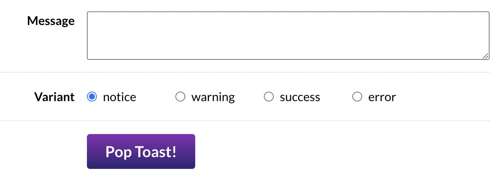
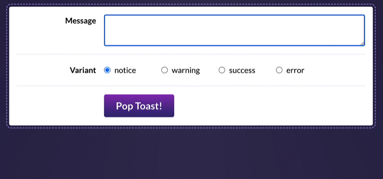
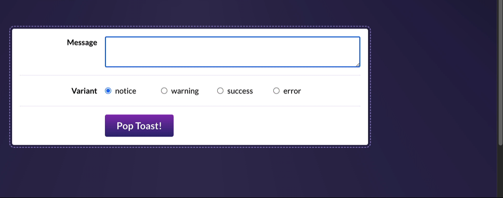

# Toast Component Project

## Joy of React, Project II

In this project, we'll dive deep into the implementation of a single common UI component: A `<Toast>` message component.


## Getting Started

This project is created with create-react-app. It's intended to be run locally, on your computer, using Node.js and NPM.

During the first project, Wordle, we saw how to run a local development server. If you're not quite sure how to get started, I recommend reviewing the [“Local Development” instructions](https://courses.joshwcomeau.com/joy-of-react/project-wordle/03-dev-server) lesson.

To jog your memory, here are the terminal commands you'll need to run:

```bash
# Install dependencies:
npm install

# Run a development server:
npm run start
```

To create new components, you can use this helper script. It saves you a bit of time, creating all the files and adding the standard code:

```bash
# Create a new component:
npm run new-component [TheNewComponentName]
```

---

## Exercise 1: Wiring up form controls

In order to test our `Toast` component, we'll start by building a little playground. This will allow us to test our component throughout development.



In `ToastPlayground.js`, you'll find most of the markup you'll need, but there are two problems:

1. All of the inputs are _uncontrolled_, meaning we can't easily access their values in React. We should use React state to drive all form controls.
2. We're only given a single radio button. We need one for each valid variant.

**This first exercise is meant to be a review of the concepts learned in Module 1 and Module 2.** So, it might be worth brushing up on some of those earlier lessons. In particular, the [Input Cheatsheet bonus lesson](https://courses.joshwcomeau.com/joy-of-react/02-state/09-bonus-cheatsheet) has some handy info about binding different types of form inputs!

**Acceptance Criteria:**

- The “Message” textarea should be driven by React state
- Using the data in the `VALID_VARIANTS` array, render 4 radio buttons within the “Variant” row. They should all be part of the same group (so that only one can be selected at a time). They should also be driven by React state.
- There should be no key warnings in the console.

---

## Exercise 2: Customizing the Toast component

Inside `src/components`, you'll find a `Toast` component. This component includes the basic DOM structure you'll need, but **it's entirely static right now.** It doesn't accept any props!

Your mission in this exercise is to render the `Toast` component within `ToastPlayground` and allow the playground to customize the Toast using the state we set up in the previous exercise. We should also figure out a "dismissal" mechanism, so that the close button functions.

Here's what it should look like, when you've solved this exercise:



For now, you can import the `Toast` component in `ToastPlayground` and render it between the header and the controls:

```jsx
<header>
  
  <h1>Toast Playground</h1>
</header>

{/* Place a <Toast /> here! */}

<div className={styles.controlsWrapper}>
  <div className={styles.row}>
```

**It's up to you to come up with the best possible “Prop API” for this component!**

If you get stuck, you may wish to review the following lessons from the course:

- [Styling in React, exercises](https://courses.joshwcomeau.com/joy-of-react/01-fundamentals/09.02-styling-exercises)
- [Slots, exercises](https://courses.joshwcomeau.com/joy-of-react/04-component-design/07.01-slots-exercises) (Especially the stretch goal from the first exercise!)

**Acceptance Criteria:**

- The toast component should show the message entered in the textarea, essentially acting as a “live preview”.
- The toast's styling should be affected by the “variant” selected:
  - The colors can be set by specifying the appropriate class on the top-level `<div>`. By default, it's set to `styles.notice`, but you'll want to dynamically select the class based on the variant (eg. for a success toast, you'll want to apply `styles.success`).
  - The icon can be selected from the `ICONS_BY_VARIANT` object. Feel free to re-organize things however you wish!
- The toast should be hidden by default, but can be shown by clicking the "Pop Toast!” button.
- The toast can be hidden by clicking the “×” button within the toast.

---

## Exercise 3: Toast Shelf

One of the core defining characteristics of toast notifications is that they stack!


Your mission in this exercise is to restructure things so that our `ToastPlayground` allows us to create _multiple_ toasts.

To help in your quest, you'll find a `ToastShelf` component in this project. It will automatically apply the styles and animations.

You'll need to replace the `Toast` live demo with this new `ToastShelf` component, inside `ToastPlayground`:

```diff
<header>
  
  <h1>Toast Playground</h1>
</header>

- <Toast />
+ <ToastShelf />

<div className={styles.controlsWrapper}>
  <div className={styles.row}>
```

By the end of this exercise, it should look like this:



**This is a very tricky exercise.** If you're not sure where to start / how to make this work, I share some [hints on the course platform](/joy-of-react/project-toast/04-solution).

Some lessons that might help, from the course:

- [The onClick Parable](https://courses.joshwcomeau.com/joy-of-react/02-state/04.02-on-click-parable)
- [Dynamic key generation](https://courses.joshwcomeau.com/joy-of-react/02-state/07-key-generation)

**Acceptance Criteria:**

- Instead of live-editing a single Toast instance, the playground should be used to push new toast messages onto a stack, rendered inside `ToastShelf` and shown in the corner of the page.
- When “Pop Toast!” is clicked, the message/variant form controls should be reset to their default state (`message` should be an empty string, `variant` should be "notice").
- Clicking the “×” button inside the toast should remove that specific toast (but leave the rest untouched).
- A proper `<form>` tag should be used in the `ToastPlayground`. The toast should be created when submitting the form.
  - See for more information.
- **There should be no key warnings in the console!** Keys should be unique, and you should not use the index.

---

## Exercise 4: Context

As it stands, all of our state has been managed by `ToastPlayground`. This works in the context of our little demo app, but it wouldn't scale well in a real-world application!

In this exercise, we'll refactor our application to use a [Provider component](https://courses.joshwcomeau.com/joy-of-react/04-component-design/08.04-provider-component). It will own all of the state related to the toasts state, and make it available to any child component who requires it.

**Acceptance Criteria:**

- Create a new component, `ToastProvider`, that will serve as the “keeper” for toast-related state.
  - To generate a new component, you can use the “new-component” script! Try tunning `npm run new-component ToastProvider` in the terminal.
- Components that require the state should pull it from context with the `useContext` hook, rather than passing through props.
- As we saw in the [“Provider Components” lesson](https://courses.joshwcomeau.com/joy-of-react/04-component-design/08.04-provider-component), we can also share _functions_ that allow consumers to alter the state. Consider making functions available that will create a new toast, or dismiss a specific toast.
- This is a “refactor” exercise. The user experience shouldn't change at all.

---

## Exercise 5: Keyboard and screen reader support

Our component so far works pretty well for sighted mouse users, but the experience isn't as great for everyone.

For keyboard users, let's add a global event handler that listens for the “escape” key, and dismisses _all_ toasts when it's pressed.

For screen-reader users, we need to change some things in our markup.

In `ToastShelf.js`, add the following 3 attributes to the wrapping `<ol>`, so that the markup looks like this:

```diff
<ol
  class="wrapper"
+ role="region"
+ aria-live="assertive"
+ aria-label="Notification"
>
```

In `Toast.js`, make the following changes:

- Within the paragraph that holds the message content, prefix it with the variant, so that the final output looks something like this:

```diff
<p class="content">
+ <span class="visually-hidden">error -</span>
  Your account could not be found
</p>
```

- Update the close button so that it uses an `aria-label` instead of the `<VisuallyHidden>` helper:

```diff
<button
  class="closeButton"
+ aria-label="Dismiss message"
+ aria-live="off"
>
  <svg>X</svg>
- <span class="visually-hidden">Dismiss message</span>
</button>
```

I realize that these changes seem totally arbitrary / we haven't learned about this stuff! In the solution video, I'll explain exactly why all these changes are necessary.

---

## Exercise 6: Custom hooks

Whew! We've done quite a bit with this lil’ `Toast` component!

In the last exercise, we added an “escape” keyboard shortcut, to dismiss all toasts in a single keystroke. This is a very common pattern, and it requires a surprising amount of boilerplate in React.

Let's build a **custom reusable hook** that makes it easy to reuse this boilerplate to solve future problems.

There are lots of different ways to tackle this, and there's no right or wrong answer, but here's one idea to get you started: what if we create a new custom hook called `useEscapeKey`?

```js
useEscapeKey(() => {
  // Code to dismiss all toasts
});
```

**This is an open-ended exercise.** Feel free to experiment with different APIs and see what works best for you!

**Acceptance Criteria:**

- Create a new `/src/hooks` directory, and add a new `.js` file for your custom hook. You can name it whatever you'd like.
- Copy over the boilerplate for event listening (eg. the `useEffect` hook, the `addEventListener` call, the cleanup function…) into this new custom hook.
- Replace the "escape" key handling with this new custom hook.
- **Make sure there are no ESLint warnings.**
  - In VSCode, ESLint warnings are shown as squiggly yellow underlines. You can view the warning by hovering over the underlined characters, or by opening the “Problems” tab (`⌘` + `Shift` + `M`, or Ctrl + `Shift` + `M`).
